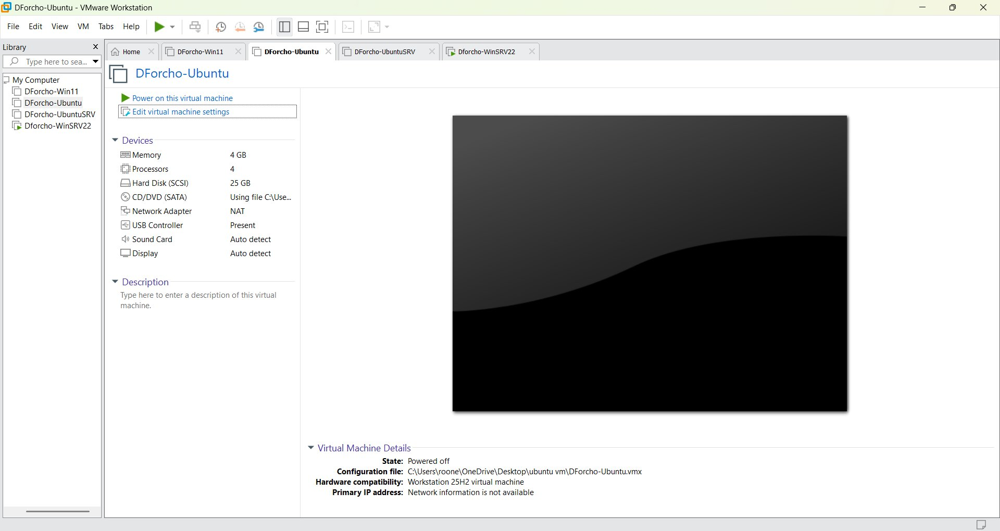

# Virtualization Lab Project

## Lab Overview
This lab involved setting up and configuring multiple Virtual Machines (VMs) using VMware Workstation 17 Pro as the hypervisor.

## Objective
Build and perform the basic setup of the following operating systems as Virtual Machines:

- Windows 11 Pro
- Windows Server 2022 (Standard Edition w/ Desktop Experience)
- Ubuntu (Client)
- Ubuntu (Server)

## Virtual Machines Created

| VM Name | Operating System | Memory | Processors | Storage |
|---|---|---|---|---|
| Rtvgb-Win11 | Windows 11 Pro | 4 GB | 4 | 25 GB |
| Rtvgb-WinSRV22 | Windows Server 2022 | 4 GB | 4 | 25 GB |
| Rtvgb-Ubuntu | Ubuntu (Client) | 4 GB | 4 | 25 GB |
| Rtvgb-UbuntuSRV | Ubuntu (Server) | 4 GB | 4 | 25 GB |

## Naming Convention
`<First Initial><Lastname>-<OS Name Abbreviation>`

## Hypervisor
- **Software:** VMware Workstation 17 Pro (Broadcom)
- **Hardware Compatibility:** Workstation 25H2
- **Network Adapter:** NAT
- **USB Controller:** Present
- **Sound Card:** Auto detect
- **Display:** Auto detect

## Proof of Completion

*Screenshot showing all 4 VMs configured in VMware Workstation: DForcho-Win11, DForcho-Ubuntu, DForcho-UbuntuSRV, and Dforcho-WinSRV22*

## Resources Used
- [How to Download and Install Broadcom's VMware Workstation 17 Pro](https://www.youtube.com/watch?v=5-dCMVwjzd0)
- [HOW TO Install Windows 11: VMware Workstation](https://www.youtube.com/watch?v=EMuw_IN-UOU)
- [Windows Server 2022 - Getting Started Installation & Configuration](https://www.youtube.com/watch?v=PwAsvSyv5mo)
- [How to Install Ubuntu 24.04 (Client) on VMware 17](https://www.youtube.com/watch?v=50dDEvGj8dM)
- [Ubuntu Server 24.04 LTS Install](https://www.youtube.com/watch?v=n7aEcfDNULc)
